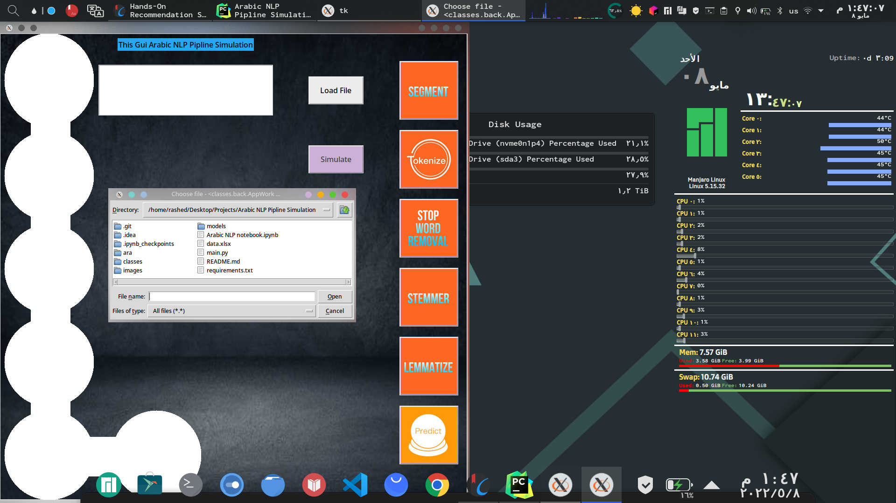
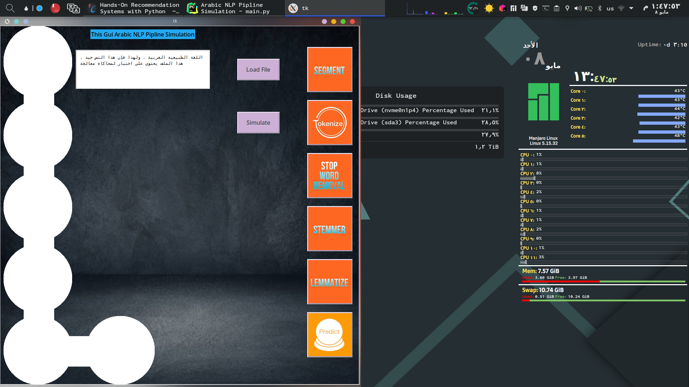
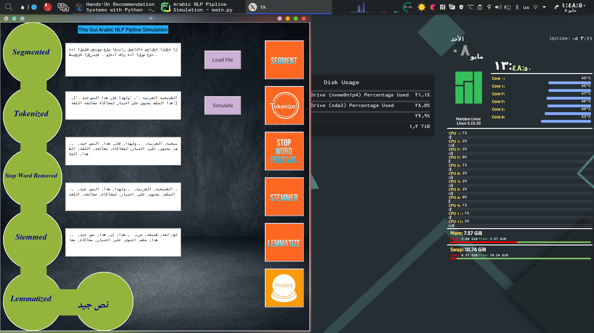

# Arabic_NLP_Simulation
Python project that simulate NLP process

[![LinkedIn][linkedin-shield]][linkedin-url]


<!-- TABLE OF CONTENTS -->
<details open="open">
  <summary>Table of Contents</summary>
  <ol>
    <li>
      <a href="#about-the-project">About The Project</a>
      <ul>
        <li><a href="#built-with">Built With</a></li>
      </ul>
    </li>
    <li>
      <a href="#getting-started">Getting Started</a>
      <ul>
        <li><a href="#installation">Installation</a></li>
      </ul>
    </li>
    <li><a href="#contact">Contact</a></li>
    
  </ol>
</details>


<!-- ABOUT THE PROJECT -->
## About The Project

This project used to simulate NLP pipline start from text segmentation 
to machine learning and model prediction


### Built With

this project build with python 3.10.0


<!-- GETTING STARTED -->
## Getting Started
Few Steps to get every thing work fine with you.

### Prerequisites
In order to use these file you must have :  

1. python 3.8.0+
2. required library to run the project 

### Installation

in order to get every thing fine you need 
to install modules in requirements.txt

This is an example of how to list things you need to use the software and how to install them.
* requirements.txt
  ```sh
  pip install -r requirements.txt.txt
  ```
it's recommended to create virtual environment and install modules in it 
in order create virtual environment  first you should have virtualenv module.
* virtualenv installation
  ```sh
  pip install virtualenv
  ```

then create the environment using
* create environment
  ```sh
  virtualenv <environment name>
  ```

<!-- CONTACT -->

## Contact

RASHED - [LinkedIn](https://www.linkedin.com/in/14-rashed/) - rashed.work609@gmail.com


<!-- USAGE EXAMPLES -->

## Usage Example

here are some screenshots from app :

  
  
 


<!-- MARKDOWN LINKS & IMAGES -->
<!-- https://www.markdownguide.org/basic-syntax/#reference-style-links -->

[linkedin-shield]: https://img.shields.io/badge/-LinkedIn-black.svg?style=for-the-badge&logo=linkedin&colorB=555
[linkedin-url]: https://www.linkedin.com/in/14-rashed/

